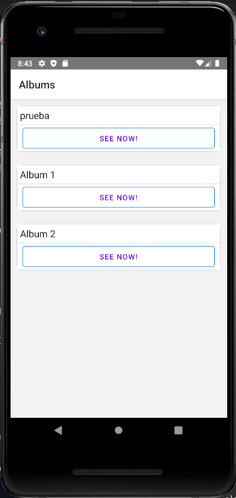
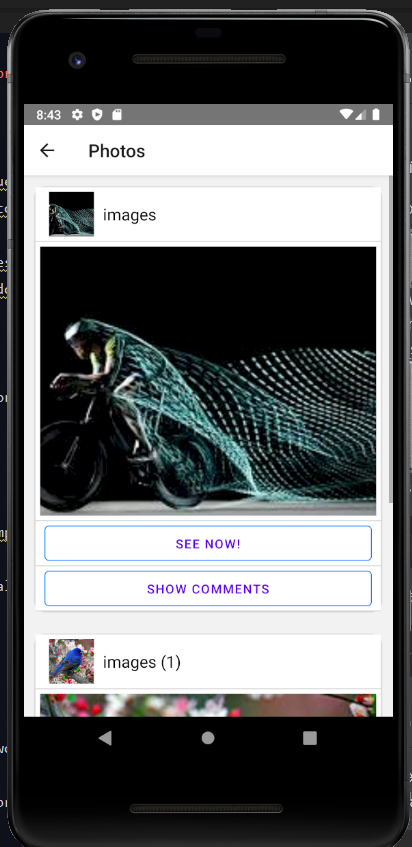

## Trabajo Practico - Desarrollo de software multipantalla 2020 5k4
## UTN - FRC 
Integrantes:
+ Leguizamon Tomassi Nicolas (70390) <br>
+ Urquiza Mayra (71024) <br>
+ Carranza Alexis Fabian (69) <br>
## Profesores
+ Rubio, Diego Martin
+ Gonzalez, Claudio Javier
## Tecnologias
* React Native
* React Navigation
* React Native Paper
## Dominio de la aplicacion
La aplicacion consume de la api de flickr que brinda informacion de albumes y fotos.
La informacion de la api se puede encontrar en el siguiente link: <br>
[https://www.flickr.com/services/api/](https://www.flickr.com/services/api/)
## Muestra de la aplicación
 <br>
 <br>
## Prerequisitos
Para correr la aplicacion debe seguir el instructivo de setup de entorno de React Native: <br>
[https://reactnative.dev/docs/environment-setup](https://reactnative.dev/docs/environment-setup)
## Despliegue en modo desarrollo
1 - Para ejecutar el proyecto debe tener instalado un emulador o un celular conectado. 
Para android ejecute los siguientes comandos sobre la carpeta raiz:
```bash
npm install
```
```bash
npm run android
```
